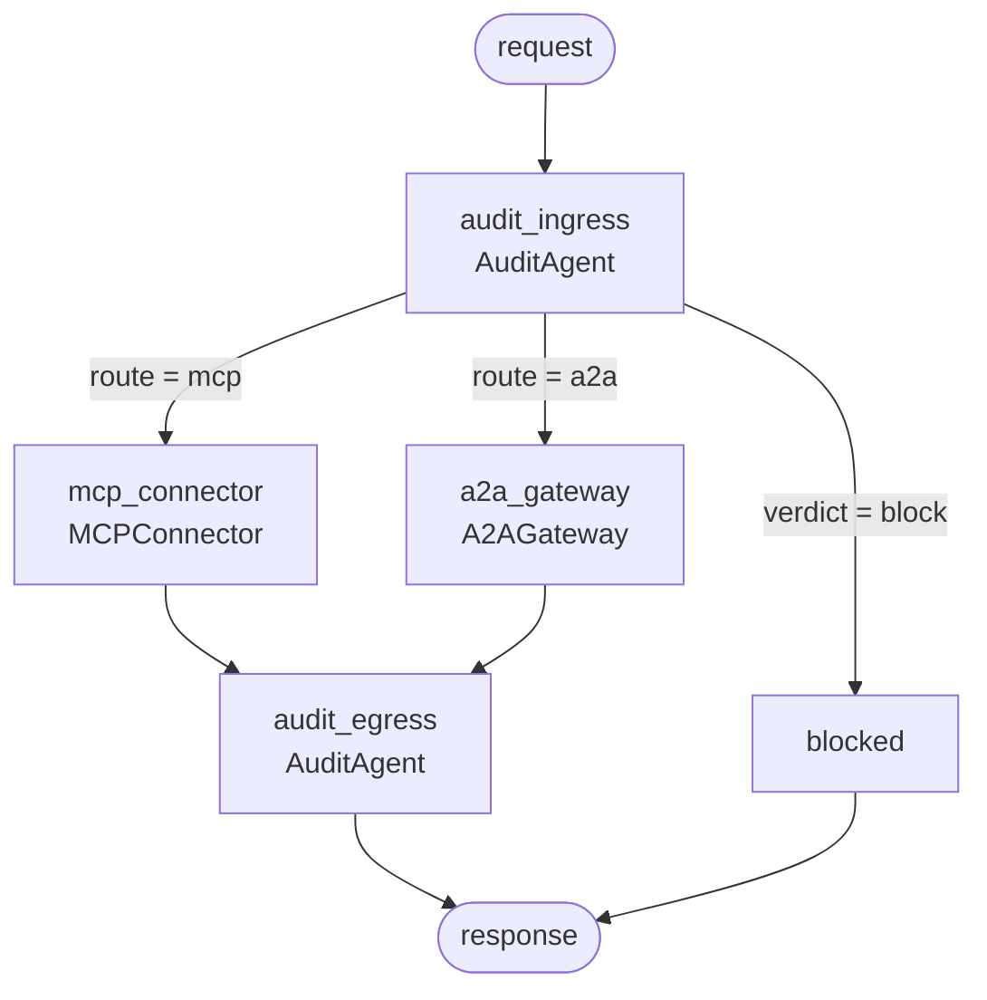

<div dir="rtl" markdown="1">

# ProtoBridge — بروتوبريدج

**طبقة تشغيل بيني بين MCP و A2A لأنظمة الذكاء الاصطناعي الوكيلة.**

تتحدّث بروتوكول **MCP** من Anthropic وبروتوكول **A2A** من Google عبر مسار واحد
محكوم، دون أن يعرف الكود المُستدعي أيّ بروتوكول يقف على الطرف الآخر، ودون فقدان
إشارة الامتثال عند الحدود.

يعمل بالكامل دون اتصال. لا مفاتيح واجهات برمجية، ولا حسابات، ولا إرسال بيانات إلى
الخارج.

**[▶ عرض تفاعلي مباشر](https://asadullah48.github.io/protobridge/)** — افحص مسارات حقيقية وتحقّق من سلسلة
التدقيق بخوارزمية SHA-256 داخل متصفّحك.

*[English](./README.md) · [المواصفة الكاملة](./SPEC.md) · [الأعمال](https://asadullahshafique-devunity.vercel.app)*

---

## لماذا يهمّ هذا المؤسسات؟

معظم منصّات الوكلاء تختار بروتوكولًا واحدًا فتحبس نفسها فيه. أمّا التي تتبنّى
الاثنين فتربطهما عادةً بوصلات مباشرة نقطة-إلى-نقطة، وتفقد بهدوء الأمور التي
يسأل عنها المدقّقون.

| هاجس المؤسسة | ما تفعله بروتوبريدج |
|---|---|
| **الارتهان للمورّد** | نوع محوري واحد `ProtocolEnvelope` يجرّد البروتوكولين معًا. استبدال أداة MCP بوكيل A2A يصبح تغييرًا في التوجيه لا إعادة كتابة. |
| **كلفة التكامل** | إضافة بروتوكول تكلّف **2N** من العمل (زوج مُرمِّزات واحد)، لا **N²** من المترجمات المباشرة. |
| **إقامة البيانات والمعلومات الشخصية** | تسافر تصنيفات الحساسية داخل الرسالة نفسها، فتُلتقَط الاستجابة الحاملة لرقم هوية وطنية وتُحجب *عند الحدود* — لا تُكتشَف لاحقًا أثناء مراجعة السجلّات. |
| **مخاطر الأطراف الثالثة** | التفويض عبر حدود المورّدين شرط من الدرجة الأولى وقابل للفحص. البيانات المقيّدة العابرة لحدود مورّد تُرفَض بالسياسة، ويرفضها الطرف المقابل استقلالًا كذلك. |
| **قابلية التدقيق** | كل قفزة تُسجَّل في دفتر مرتبط بالتجزئة (hash-chained). العبث قابل للكشف والتحديد، ورأس السلسلة قابل للنشر كإثبات خارجي. |
| **إمكانية التتبّع** | معرّف تتبّع `trace_id` واحد يربط استدعاء أداة MCP بالتفويض A2A الذي نتج عنه — ويُتحقَّق منه عند العودة لا يُفترَض. |
| **انحراف البروتوكولات** | إصدارات البروتوكول غير المدعومة تُرفَض بدل تخفيضها صامتًا. |

---

## البدء السريع

```bash
git clone <this-repo> && cd protobridge
uv sync --extra dev
uv run protobridge demo
```

يشغّل ذلك ستّة سيناريوهات مقابل **خادم MCP حقيقي في عملية فرعية** و**وكيل A2A
حقيقي عبر HTTP** — مسارات السماح والحجب والحظر — ثم يتحقّق من سلسلة التدقيق.
مخرجات مختصرة:

```
[2] MCP tool returning PII, caller under-cleared -> redaction
    route     : mcp
    verdict   : redact
    findings  : SEC-001(high)
    redacted  : email, national_id, salary_band
    content   : {"record": {"name": "Ada Lovelace", "email": "[REDACTED]", ...}}

[5] A2A delegation carrying restricted data across a vendor boundary
    route     : blocked
    verdict   : block
    findings  : SEC-002(critical)
    error     : blocked at ingress by AuditAgent: SEC-002

audit ledger
  entries    : 10
  chain      : INTACT
  head       : 147240e3a09c6cb3...
```

---

## الأوامر

| الأمر | وظيفته |
|---|---|
| `protobridge demo` | سيناريو التشغيل البيني الكامل، دون اتصال |
| `protobridge demo --ledger-out audit.jsonl` | الأمر نفسه مع تصدير سلسلة التدقيق بصيغة JSON Lines |
| `protobridge audit` | يشغّل السيناريو ثم يثبت أنّ العبث يُكتشَف ويُحدَّد موضعه |
| `protobridge graph` | يطبع رسم الوكلاء بصيغة mermaid |
| `protobridge card` | يطبع بطاقة الوكيل A2A المرجعية |
| `protobridge tools` | يطبع كتالوج أدوات MCP المرجعي |
| `protobridge serve-mcp` | يشغّل خادم MCP المرجعي على stdio |
| `protobridge serve-a2a --port 8931` | يشغّل وكيل A2A المرجعي عبر HTTP |

وجّه أيّ عميل MCP إلى `uv run protobridge serve-mcp`، أو اجلب بطاقة الوكيل:

```bash
uv run protobridge serve-a2a &
curl -s http://127.0.0.1:8931/.well-known/agent.json
```

---

## الوكلاء الثلاثة



- **MCPConnector** — يدمج واجهات وأدوات خارجية عبر MCP (JSON-RPC على stdio).
  يُبقي جلسة واحدة مفتوحة عبر الاستدعاءات، لأنّ `initialize` لكل اتصال لا لكل
  استدعاء.
- **A2AGateway** — يتيح التواصل بين وكلاء موردين مختلفين عبر A2A (JSON-RPC على
  HTTP). يكتشف الأقران ببطاقة الوكيل ويفوّض العمل كمهامّ يحقّ للطرف الآخر رفضها.
- **AuditAgent** — يراقب الامتثال والالتزام بالبروتوكول. يعمل **مرّتين في كل
  قفزة**: تحكّم بالقبول قبل الإرسال، وتحكّم بالخروج بعده.

لاحظ أنّه لا توجد حافة من `START` إلى أيّ موصّل مباشرةً. التدقيق بنيوي — لا يمكن
نسيان استدعائه.

---

## قرارات تصميمية تستحقّ المعرفة

**نوع محوري واحد لا N² مترجمًا.** كل رسالة تُرفَع إلى `ProtocolEnvelope` ثم
تُخفَض إلى البروتوكول الهدف.

**الحوكمة تسافر داخل الرسالة.** معرّفات التتبّع وتصنيفات الحساسية حقولٌ في
المغلّف لا ترويسات نقل — فالترويسات لا تنجو من قفزة stdio في MCP.

**تُوسَّع البروتوكولات ولا تُشتَقّ.** تنتقل التصنيفات عبر `_meta` المحجوز في MCP
و`metadata` في A2A، فيظلّ العميل القياسي على الطرف الآخر قادرًا على التشغيل
البيني.

**مرحلتا تدقيق، لأنّ كلًّا منهما ترى شيئًا مختلفًا.** القبول لا يمكنه معرفة أنّ
الاستجابة ستحمل رقم هوية وطنية، والخروج لا يمكنه سحب طلبٍ أُرسِل.

**الاستدلال ليس حاملًا للحِمل أبدًا.** المُستدِل يكتب السرد المقروء بشريًّا فقط،
ولا يستطيع تغيير أيّ حكم — وهذا ما يجعل الوضع الافتراضي دون اتصال صادقًا.

**درز سياسة واحد.** القواعد تُبلّغ عن الوقائع، و`rules.decide_verdict()` تقرّر ما
يُفعَل بها. وهي موسومة بـ `=== POLICY SEAM ===` وهي الدالة الوحيدة التي تُعدَّل
حين يختلف موقف مؤسستك من المخاطر عن الوضع الافتراضي.

---

## سرد محلّي اختياري

المُستدِل الافتراضي حتميّ ولا يحتاج إلى شيء. وللحصول على ملخّصات تدقيق بلغة
طبيعية من نموذج تشغّله بنفسك:

```bash
ollama serve && ollama pull llama3.2
PROTOBRIDGE_LLM=ollama uv run protobridge demo
```

| المتغيّر | الافتراضي | الغرض |
|---|---|---|
| `PROTOBRIDGE_LLM` | `deterministic` | `deterministic` أو `ollama` |
| `PROTOBRIDGE_MODEL` | `llama3.2` | اسم النموذج المحلّي |
| `PROTOBRIDGE_OLLAMA_URL` | `http://127.0.0.1:11434` | نقطة نهاية Ollama المحلّية |

إذا كانت الخدمة متوقّفة أو النموذج مفقودًا، يتراجع السرد إلى المُستدِل الحتمي.
ولا يُعطِّل الجسر أبدًا.

---

## التطوير

```bash
uv run pytest          # 41 اختبارًا
uv run ruff check .
uv run ruff format .
```

مجموعة اختبارات MCP مُعامَلة على **كلا** النقلين — مُوزِّع داخل العملية، وعملية
فرعية حقيقية على stdio — لتبقى الاختبارات سريعة دون ترك مسار السلك دون فحص.

---

## بنية المشروع

```
src/protobridge/
  envelope.py            ProtocolEnvelope — النوع المحوري
  protocols/
    jsonrpc.py           تأطير JSON-RPC 2.0 المشترك + المُوزِّع
    mcp.py               أنواع MCP، الخادم المرجعي، عميل stdio
    a2a.py               بطاقة وكيل A2A، خادم HTTP، العميل
  agents.py              MCPConnector و A2AGateway و AuditAgent
  rules.py               قواعد الامتثال + درز السياسة
  ledger.py              دفتر تدقيق مرتبط بالتجزئة
  graph.py               ربط LangGraph
  llm.py                 سرد قابل للاستبدال (دون اتصال افتراضيًّا)
  cli.py                 نقطة دخول سطر الأوامر
```

---

## الحالة والحدود

هذا **تنفيذ مرجعي**، وحدوده مقصودة: لا مصادقة، ولا TLS، ولا تحديد معدّل، ولا
تخزين دائم؛ وخادم A2A هو `http.server`؛ والدفتر في الذاكرة مع درز تصدير بصيغة
JSON Lines؛ والبثّ خارج النطاق وبطاقة الوكيل تصرّح بذلك بصدق. كل بيانات الأدوات
والمهارات اصطناعية — لا تظهر أيّ بيانات حقيقية لموظّفين أو موردين أو أسعار صرف في
هذا المستودع.

راجع [SPEC.md](./SPEC.md) القسم ١٢ للقائمة الكاملة.

## الرخصة

MIT

</div>
