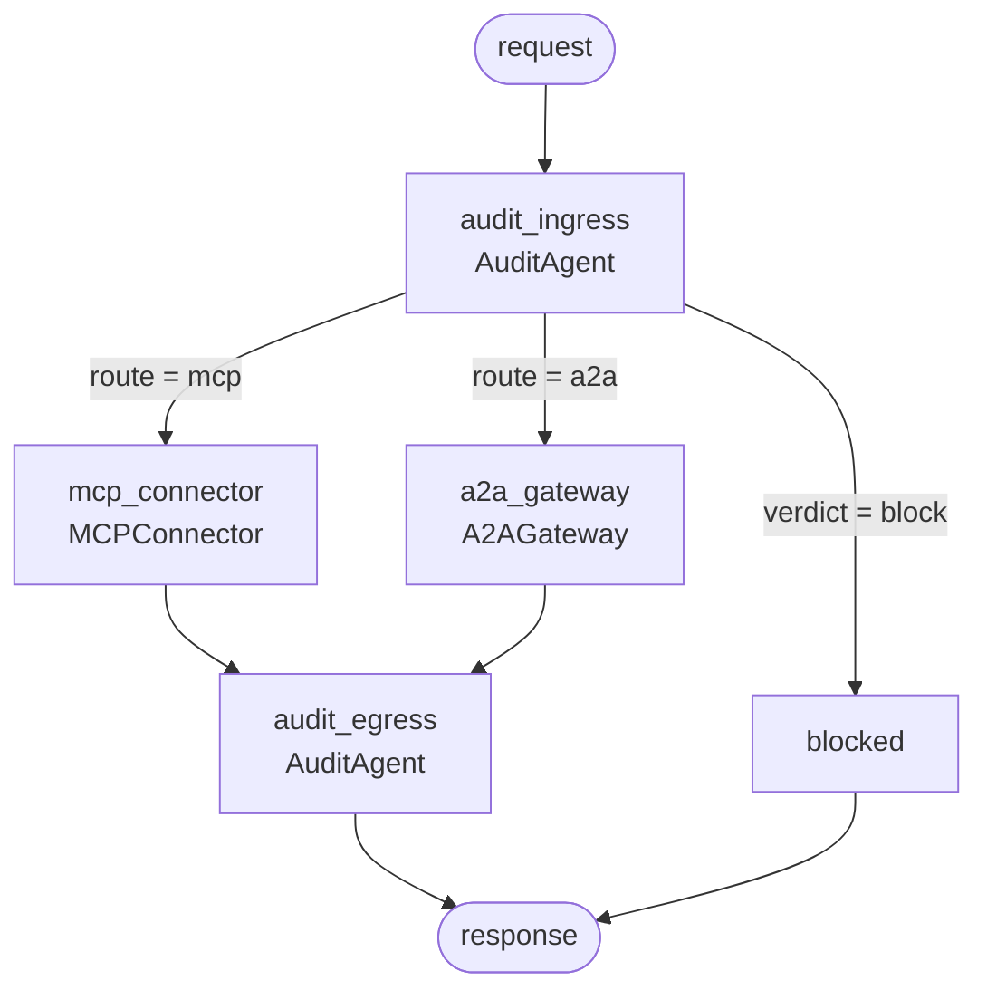

# ProtoBridge

**An MCP + A2A interoperability layer for agentic AI systems.**

Speak Anthropic's **Model Context Protocol** and Google's **Agent2Agent**
through one governed pipeline — without the calling code knowing which protocol
is on the other side, and without losing the compliance signal at the boundary.

Runs entirely offline. No API keys, no accounts, no cloud egress.

*[العربية](./README.ar.md) · [Full specification](./SPEC.md)*

---

## Why this matters for enterprises

Most agent platforms pick one protocol and strand themselves. The ones that
adopt both usually bolt them together with point-to-point glue, and quietly lose
the things auditors ask about.

| Enterprise concern | What ProtoBridge does |
|---|---|
| **Vendor lock-in** | One `ProtocolEnvelope` abstracts both protocols. Swapping an MCP tool for an A2A peer is a routing change, not a rewrite. |
| **Integration cost** | Adding a protocol costs **2N** work (one codec pair), not **N²** point-to-point translators. |
| **Data residency & PII** | Sensitivity labels ride inside the message, so a response carrying a national id is caught and redacted *at the boundary* — not discovered in a log review. |
| **Third-party risk** | Cross-vendor delegation is a first-class, checkable condition. Restricted data crossing a vendor boundary is refused by policy, and the peer refuses it independently too. |
| **Auditability** | Every hop lands in a hash-chained ledger. Tampering is detectable and locatable, and the chain head is publishable as external proof. |
| **Traceability** | One `trace_id` correlates an MCP tool call with the A2A delegation it triggered — verified on the way back, not assumed. |
| **Protocol drift** | Unsupported protocol versions are refused rather than silently downgraded. |

---

## Quickstart

```bash
git clone <this-repo> && cd protobridge
uv sync --extra dev
uv run protobridge demo
```

That runs six scenarios against a **real MCP server in a subprocess** and a
**real A2A agent over HTTP** — allow, redact, and block paths — then verifies
the audit chain. Abridged output:

```
[2] MCP tool returning PII, caller under-cleared -> redaction
    route     : mcp
    verdict   : redact
    findings  : SEC-001(high)
    redacted  : email, national_id, salary_band
    content   : {"record": {"name": "Ada Lovelace", "email": "[REDACTED]", ...}}

[5] A2A delegation carrying restricted data across a vendor boundary
    route     : blocked
    verdict   : block
    findings  : SEC-002(critical)
    error     : blocked at ingress by AuditAgent: SEC-002

audit ledger
  entries    : 10
  chain      : INTACT
  head       : 147240e3a09c6cb3...
```

---

## Commands

| Command | What it does |
|---|---|
| `protobridge demo` | Full interoperability scenario, offline |
| `protobridge demo --ledger-out audit.jsonl` | Same, exporting the audit chain as JSON Lines |
| `protobridge audit` | Runs the scenario, then proves tampering is detected and located |
| `protobridge graph` | Prints the agent graph as mermaid |
| `protobridge card` | Prints the reference A2A Agent Card |
| `protobridge tools` | Prints the reference MCP tool catalogue |
| `protobridge serve-mcp` | Runs the reference MCP server on stdio |
| `protobridge serve-a2a --port 8931` | Runs the reference A2A agent over HTTP |

Point any MCP client at `uv run protobridge serve-mcp`, or `curl` the Agent Card:

```bash
uv run protobridge serve-a2a &
curl -s http://127.0.0.1:8931/.well-known/agent.json
```

---

## The three agents



- **MCPConnector** — integrates external APIs and tools over MCP (JSON-RPC on
  stdio). Holds one session open across calls, since `initialize` is
  per-connection rather than per-invocation.
- **A2AGateway** — enables cross-vendor agent communication over A2A (JSON-RPC
  on HTTP). Discovers peers by Agent Card and delegates work as tasks the peer
  is free to refuse.
- **AuditAgent** — monitors compliance and protocol adherence. Runs **twice per
  hop**: admission control before dispatch, egress control after.

Note there is no edge from `START` into a connector. The audit is structural —
you cannot forget to call it.

---

## Design decisions worth knowing

**One pivot type, not N² translators.** Every message is lifted into a
`ProtocolEnvelope` and lowered into the target protocol.

**Governance rides inside the message.** Trace ids and classification labels are
envelope fields, not transport headers — headers do not survive an MCP stdio hop.

**Protocols are extended, never forked.** Labels travel in MCP's reserved `_meta`
and A2A's `metadata`, so a stock client on the other end still interoperates.

**Two audit phases, because they see different things.** Ingress cannot know a
response will carry a national id; egress cannot un-send a request.

**Reasoning is never load-bearing.** The reasoner writes the human-readable
narrative and nothing else. It cannot change a verdict, which is what makes the
offline default honest.

**One policy seam.** Rules report facts; `rules.decide_verdict()` decides what to
do about them. It is marked `=== POLICY SEAM ===` and is the single function to
edit when your organization's risk posture differs from the default.

---

## Optional local narration

The default reasoner is deterministic and needs nothing. To get
natural-language audit summaries from a model you run yourself:

```bash
ollama serve && ollama pull llama3.2
PROTOBRIDGE_LLM=ollama uv run protobridge demo
```

| Variable | Default | Purpose |
|---|---|---|
| `PROTOBRIDGE_LLM` | `deterministic` | `deterministic` or `ollama` |
| `PROTOBRIDGE_MODEL` | `llama3.2` | Local model name |
| `PROTOBRIDGE_OLLAMA_URL` | `http://127.0.0.1:11434` | Local Ollama endpoint |

If the daemon is down or the model is missing, narration degrades to the
deterministic reasoner. It never breaks the bridge.

---

## Development

```bash
uv run pytest          # 41 tests
uv run ruff check .
uv run ruff format .
```

The MCP suite is parametrized over **both** transports — an in-process
dispatcher and a real stdio subprocess — so tests stay fast without letting the
wire path go unexercised.

---

## Project layout

```
src/protobridge/
  envelope.py            ProtocolEnvelope — the pivot type
  protocols/
    jsonrpc.py           shared JSON-RPC 2.0 framing + dispatcher
    mcp.py               MCP types, reference server, stdio client
    a2a.py               A2A Agent Card, HTTP server, client
  agents.py              MCPConnector, A2AGateway, AuditAgent
  rules.py               compliance rules + the policy seam
  ledger.py              hash-chained audit ledger
  graph.py               LangGraph wiring
  llm.py                 pluggable narration (offline by default)
  cli.py                 command-line entry point
```

---

## Status and limitations

This is a **reference implementation**, and the boundaries are deliberate: no
authentication, TLS, rate limiting, or persistence; the A2A server is
`http.server`; the ledger is in-memory with a JSON Lines export seam; streaming
is out of scope and the Agent Card says so honestly. All tool and skill data is
synthetic — no real employee, vendor, or FX data appears anywhere in this
repository.

See [SPEC.md](./SPEC.md) §12 for the full list.

## License

MIT
