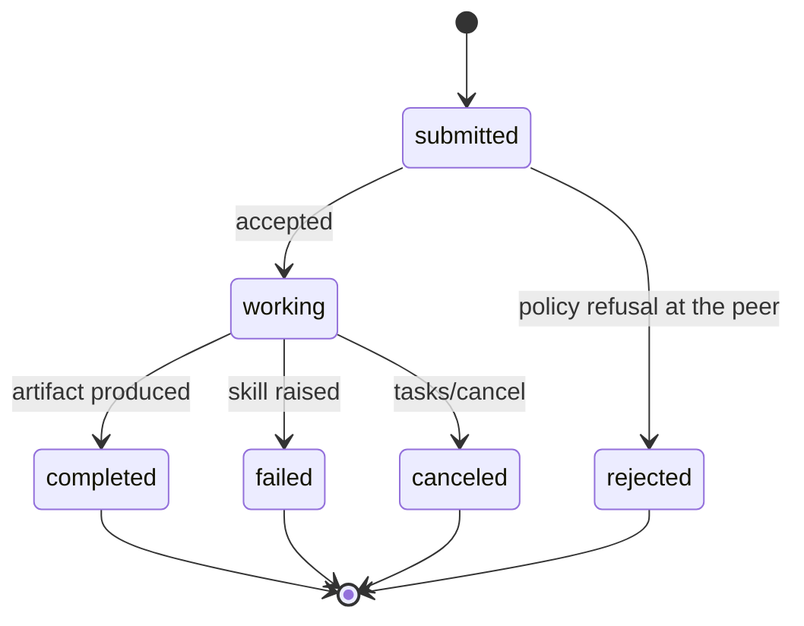
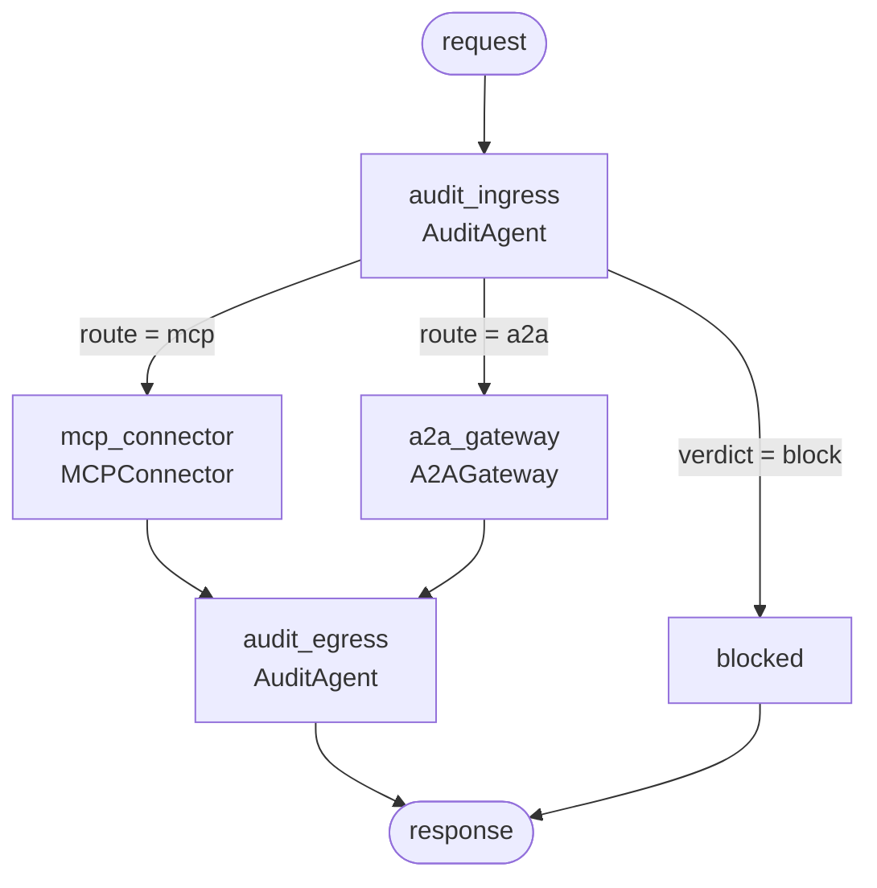
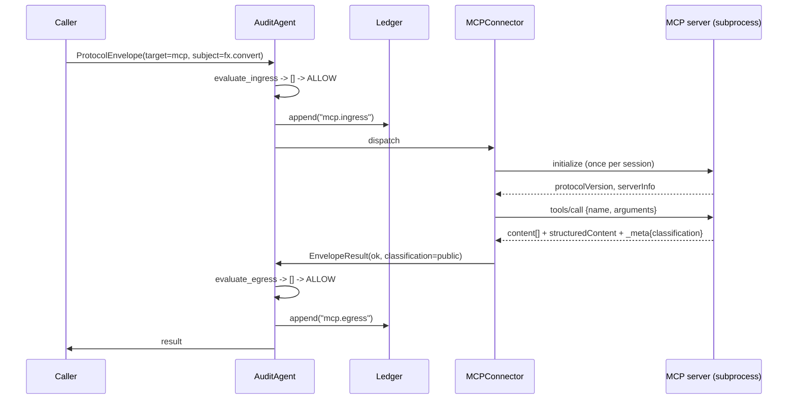
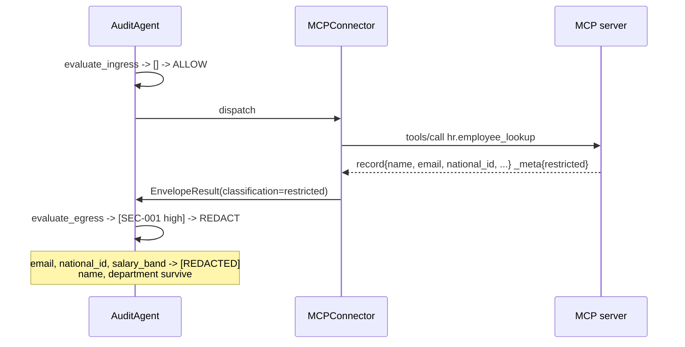
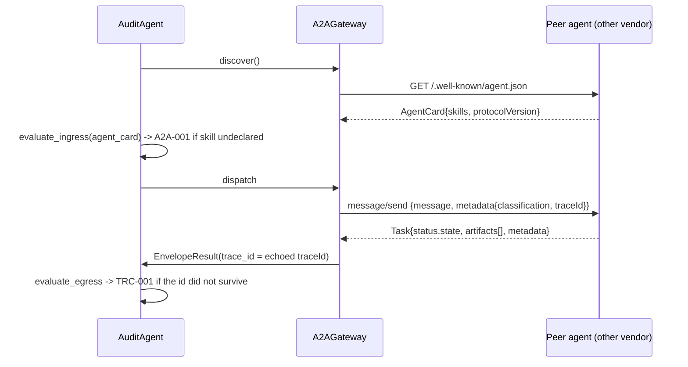
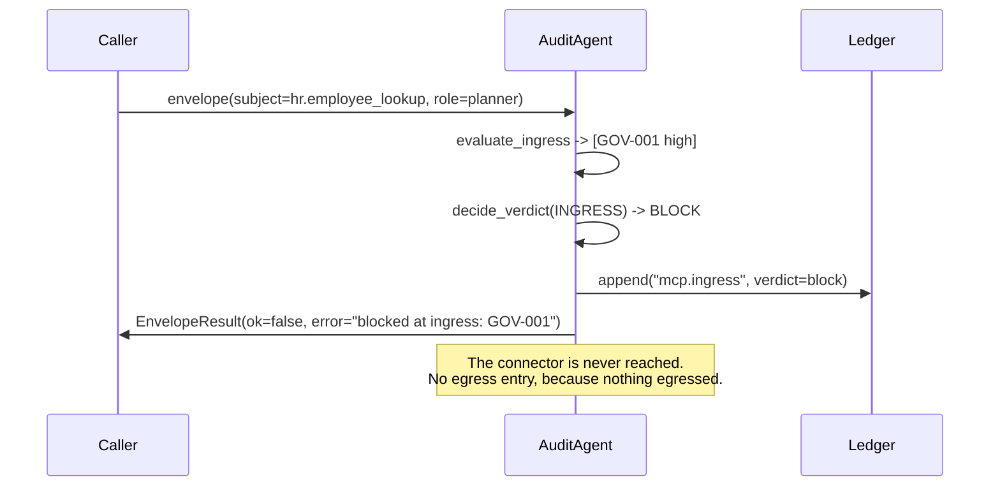

# ProtoBridge Specification

**Version 0.1.0** · Status: reference implementation · Audience: platform and compliance engineers

ProtoBridge is an interoperability layer that lets one agentic system speak both
**MCP** (Anthropic's Model Context Protocol) and **A2A** (Google's Agent2Agent)
without the calling code knowing which protocol is on the other side — and
without losing the governance signal at the boundary.

---

## 1. Problem statement

MCP and A2A solve adjacent but different problems, and a real enterprise agent
needs both:

| | MCP | A2A |
|---|---|---|
| Question it answers | "What tools do you have?" | "Who are you, and what can you do?" |
| Counterparty | A capability you host or vendor | An autonomous agent, often another vendor's |
| Transport | JSON-RPC 2.0 over **stdio** | JSON-RPC 2.0 over **HTTP** |
| Discovery | `tools/list` on an open session | `GET /.well-known/agent.json` |
| Unit of work | A **call** — request in, result out | A **task** — with a lifecycle and the right to refuse |
| Trust model | You spawned the process | Peer across an organizational boundary |
| Failure mode | RPC error | Task state (`rejected`, `failed`, `canceled`) |

Wiring these together ad hoc produces N×N translators and, worse, drops the
governance context at every seam: the caller's identity, the data's sensitivity,
and the correlation id all evaporate when a message changes protocol.

ProtoBridge fixes both problems with one move.

---

## 2. Design principles

1. **One pivot type, not N² translators.** Every inbound message is *lifted*
   into a `ProtocolEnvelope`; every outbound message is *lowered* from one.
   Adding a protocol costs one codec pair (2N), not N² adapters.
2. **Governance rides inside the envelope.** Trace ids and classification
   labels travel as message fields, never as transport headers — headers do not
   survive an MCP stdio hop.
3. **Audit is structural, not optional.** The graph has no edge into a protocol
   adapter that bypasses admission control.
4. **Reasoning is never load-bearing.** The reasoner narrates outcomes; it never
   routes and never enforces. The system is fully deterministic without it.
5. **Extend the protocols, never fork them.** Sensitivity labels use MCP's
   reserved `_meta` and A2A's `metadata`. A stock client on the other end still
   interoperates.

---

## 3. Core model

### 3.1 `ProtocolEnvelope`

The protocol-neutral request. Defined in `src/protobridge/envelope.py`.

| Field | Type | Purpose |
|---|---|---|
| `envelope_id` | `str` | Unique per hop (`env_…`) |
| `trace_id` | `str` | Stable across every hop of one request (`trc_…`) |
| `created_at` | `datetime` | ISO-8601, timezone-aware UTC |
| `source` | `Protocol` | Where the message came from |
| `target` | `Protocol` | Which adapter will carry it — drives routing |
| `intent` | `Intent` | `tool.invoke`, `agent.delegate`, `capability.discover` |
| `subject` | `str` | MCP tool name **or** A2A skill id |
| `payload` | `dict` | Protocol-neutral arguments |
| `principal` | `Principal` | Who is asking — drives allowlists and redaction |
| `classification` | `Classification` | `public` < `internal` < `confidential` < `restricted` |

`Principal` carries `subject`, `role`, `tenant`, `clearance`, and
`crosses_vendor_boundary` — the last of which turns an ordinary delegation into
a regulated data export.

`envelope.child()` derives a downstream envelope that **keeps the same
`trace_id`**, which is what makes an MCP call and the A2A delegation it
triggered correlatable in the ledger.

### 3.2 `EnvelopeResult`

The protocol-neutral response: `ok`, `content`, `error`, `classification`,
`latency_ms`, plus the `trace_id` **as observed coming back** — not as assumed.

---

## 4. Protocol bindings

### 4.1 MCP binding

- **Transport:** newline-delimited JSON frames on stdin/stdout. stdout carries
  *nothing else* — all diagnostics go to stderr.
- **Preferred version:** `2025-06-18`. Also accepts `2025-03-26`, `2024-11-05`.
  An unsupported version is refused, never silently downgraded (rule `MCP-001`).
- **Methods implemented:** `initialize`, `notifications/initialized`, `ping`,
  `tools/list`, `tools/call`.
- **Classification channel:** `result._meta["protobridge/classification"]`.
  `_meta` is reserved by the spec for implementation-defined annotations, so a
  stock MCP client ignores it harmlessly.

Reference tool catalogue (`protobridge tools`):

| Tool | Classification | Why it exists |
|---|---|---|
| `fx.convert` | `public` | The clean path — nothing to govern |
| `kb.search` | `internal` | Ordinary business data |
| `hr.employee_lookup` | `restricted` | Returns PII, so egress control has something real to catch |

### 4.2 A2A binding

- **Transport:** JSON-RPC 2.0 over HTTP `POST /`.
- **Discovery:** `GET /.well-known/agent.json` (and `/.well-known/agent-card.json`).
- **Version:** `0.3.0`, advertised in the Agent Card.
- **Methods implemented:** `message/send`, `tasks/send` (legacy alias),
  `tasks/get`, `tasks/cancel`, `agent/getAuthenticatedExtendedCard`.
- **Classification channel:** `message.metadata["protobridge/classification"]`.
- **Trace channel:** `message.metadata["protobridge/traceId"]`, echoed back on
  the Task so the caller can *verify* propagation rather than assume it.

Task lifecycle:



The `rejected` state matters: the reference peer refuses `restricted` input
**at its own boundary**, proving policy is enforced on both sides of the wire
rather than only by the caller.

---

## 5. Agent topology



| Agent | Responsibility |
|---|---|
| **MCPConnector** | Integrates external APIs and tools over MCP. Holds one session open across calls, because `initialize` is per-connection, not per-invocation. |
| **A2AGateway** | Enables cross-vendor agent communication over A2A. Fetches and caches the Agent Card, lowers envelopes onto `message/send`, lifts Tasks back. |
| **AuditAgent** | Monitors compliance and protocol adherence. Runs **twice per hop** and writes every decision to the ledger. |

There is no edge from `START` to a connector. Admission control cannot be
skipped by forgetting to call it.

---

## 6. Interoperability flows

### 6.1 MCP tool call, permitted



### 6.2 MCP tool returning PII to an under-cleared caller

Ingress is clean — `hr-agent` *is* allowed to call `hr.employee_lookup`. The
finding only appears once the response exists:



This is precisely why the audit runs in two phases: **ingress could not have
known** the response would carry a national id.

### 6.3 A2A delegation across a vendor boundary



### 6.4 Blocked at ingress



---

## 7. Compliance rule catalogue

Rules live in `src/protobridge/rules.py`, grouped by **phase** rather than by
protocol.

### 7.1 Ingress — "should this be allowed to leave?"

| Code | Severity | Condition |
|---|---|---|
| `GOV-001` | high | Tool is outside the principal's role allowlist |
| `GOV-002` | high | A2A skill is outside the principal's role allowlist |
| `MCP-001` | critical | Peer negotiated an unsupported MCP protocol version |
| `A2A-001` | high | Requested skill is not declared on the peer's Agent Card |
| `A2A-002` | medium | Agent Card advertises a different A2A version than the bridge speaks |
| `SEC-002` | critical | `restricted` payload is crossing a vendor boundary |
| `PRO-002` | low | Delegation intent routed onto MCP, which has no task lifecycle |

### 7.2 Egress — "is this safe to hand back?"

| Code | Severity | Condition |
|---|---|---|
| `SEC-001` | high | Response exposes PII fields above the principal's clearance |
| `PRO-001` | medium | Response classification exceeds clearance (no PII fields present) |
| `TRC-001` | medium | Trace id did not survive the hop |
| `PRO-003` | low | Failed result carries no error description |

PII detection walks **field names** declared by the source protocol
(`mcp.PII_FIELDS`), not value patterns — a national id formatted unusually
would defeat a regex, and a regex would false-positive on ordinary numbers.

---

## 8. Enforcement policy

Rules report *facts*. What to do about them is a business decision, isolated in
a single function — `rules.decide_verdict()`, marked `=== POLICY SEAM ===`.

The default is deliberately **asymmetric**:

| Phase | Worst severity | Verdict | Rationale |
|---|---|---|---|
| ingress | ≥ high | `BLOCK` | Nothing has left the building; blocking is cheap |
| ingress | < high | `ALLOW` | Recorded, not enforced |
| egress | critical | `BLOCK` | Destroy the response outright |
| egress | high | `REDACT` | The work is already paid for; drop the fields, keep the rest |
| egress | < high | `ALLOW` | Recorded, not enforced |

Operators may reasonably invert this. A regulated tenant might make egress
fail-closed too, accepting the wasted work. A latency-sensitive one might
downgrade ingress `high` to a warning and lean on egress redaction alone.
Changing the policy requires editing exactly one function and no rules.

---

## 9. Audit ledger

Append-only and **hash-chained**: each entry hashes over the previous entry's
hash, so rewriting entry *k* invalidates *k+1…N* and `verify()` names the break.

Entry schema (JSON Lines, via `protobridge demo --ledger-out`):

```json
{
  "seq": 0,
  "ts": "2026-08-27T10:15:00+00:00",
  "event": "mcp.ingress",
  "trace_id": "trc_ab12cd34ef56",
  "actor": "svc:planner",
  "payload_digest": "9f2c81…",
  "prev_hash": "0000000000000000000000000000000000000000000000000000000000000000",
  "entry_hash": "13228ead…",
  "detail": { "subject": "fx.convert", "verdict": "allow", "violations": [] }
}
```

Two properties worth stating explicitly:

- **The chain covers a payload *digest*, not the payload.** The integrity proof
  survives even when policy required the sensitive bytes be dropped — you keep
  provability without retaining PII.
- **`head()` is publishable.** Emitting the chain head to an external system
  makes the log externally provable without exporting its contents.

Verify with `protobridge audit`, which runs the scenario and then tampers with
a synthetic chain to show the break being detected and located.

---

## 10. Conformance

Every claim above is covered by an executable test (`uv run pytest`, 41 tests):

| Area | Tests |
|---|---|
| JSON-RPC framing, notifications, error codes | `tests/test_protocols.py` |
| MCP handshake, discovery, invocation — **both** transports | `tests/test_protocols.py` (parametrized) |
| MCP version refusal, `_meta` classification | `tests/test_protocols.py` |
| A2A Agent Card, task lifecycle, peer-side refusal, trace echo | `tests/test_protocols.py` |
| Ledger chaining, tamper detection, digest-not-payload | `tests/test_compliance.py` |
| Each rule code | `tests/test_compliance.py` |
| Policy seam asymmetry | `tests/test_compliance.py` |
| End-to-end allow / redact / block routes | `tests/test_compliance.py` |

---

## 11. Extending the bridge

To add a third protocol (say, an internal gRPC agent bus):

1. Write `protocols/<name>.py` with a codec pair — lift to `ProtocolEnvelope`,
   lower from it. Reuse `jsonrpc.Dispatcher` if the protocol is JSON-RPC based.
2. Add a member to `Protocol` in `envelope.py`.
3. Add an agent class in `agents.py` exposing `discover()` and an invoke method.
4. Add one node and one branch in `graph.py`.
5. Add rules to `evaluate_ingress` / `evaluate_egress` as needed.

Nothing in steps 1–5 touches the other protocols, the ledger, or the policy
seam. That is the return on the pivot-type design.

---

## 12. Non-goals and limitations

- **Not a production gateway.** No authentication, TLS, rate limiting, or
  persistence. The A2A server is `http.server`, suitable for reference and
  tests, not for traffic.
- **In-memory ledger.** Durable, replicated storage is left to the operator;
  `write_jsonl()` is the export seam.
- **Streaming is out of scope.** A2A `message/stream` and push notifications are
  advertised as unsupported in the Agent Card — honestly rather than aspirationally.
- **`TRC-001` is only reachable on the A2A path**, because MCP has no metadata
  echo to lose. This is a property of the protocols, not an oversight.
- **The reference tool and skill data is synthetic.** No real employee, vendor,
  or FX data is included anywhere in this repository.
